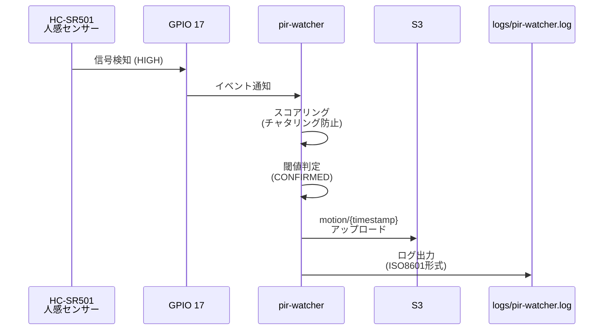
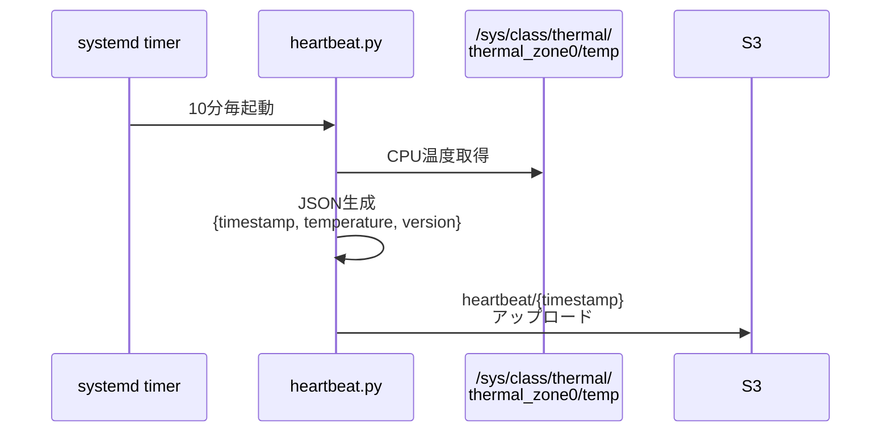
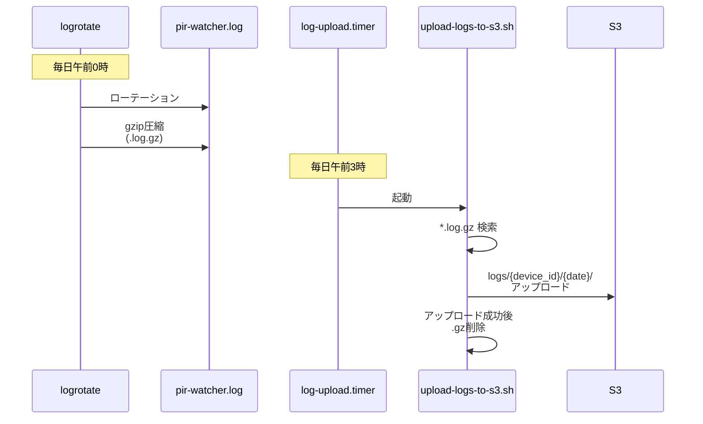
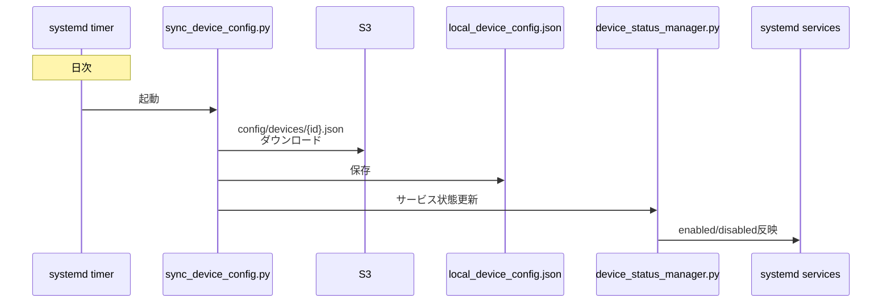

# Raspberry Pi コンポーネント

anpi-watchシステムのRaspberry Pi側コンポーネントの概要です。

## 構成

```mermaid
graph TB
    subgraph "Hardware"
        PIR[人感センサー<br/>HC-SR501]
    end

    subgraph "Services/Timers"
        PIRW[pir-watcher<br/>service]
        HB[heartbeat<br/>timer]
        LOG[log-upload<br/>timer]
        SYNC[sync_device_config<br/>timer]
    end

    subgraph "Storage"
        LOCAL[/home/anpi/anpi-watch/logs/<br/>pir-watcher.log]
        CONFIG[/home/anpi/anpi-watch/pi/config/<br/>local_device_config.json]
    end

    subgraph "AWS S3"
        S3[(S3 Bucket)]
    end

    PIR -->|GPIO 17| PIRW
    PIRW -->|ログ出力| LOCAL
    LOCAL -->|logrotate<br/>日次圧縮| LOG
    LOG -->|午前3時| S3

    HB -->|10分毎| S3
    PIRW -->|検知時| S3
    SYNC -->|日次| S3
    S3 -->|設定DL| CONFIG
```

## コンポーネント一覧

| コンポーネント | 役割 | 実行方式 | 実行頻度 |
|--------------|------|---------|---------|
| [pir-watcher](pir-watcher/README.md) | 人感センサー監視・記録 | systemd service | 常駐 |
| [heartbeat](heartbeat/README.md) | 生存確認・CPU温度送信 | systemd timer | 10分毎 |
| [log-upload](LOGGING.md#log-upload) | ログS3アップロード | systemd timer | 日次3時 |
| [sync_device_config](sync_device_config/README.md) | 設定同期 | systemd timer | 日次 |

## データフロー

### 1. 人感センサー検知フロー



### 2. Heartbeat送信フロー



### 3. ログアップロードフロー



### 4. 設定同期フロー



## ディレクトリ構造

```
/home/anpi/anpi-watch/
├── pi/
│   ├── config/
│   │   ├── local_device_config.json   # デバイス設定
│   │   ├── runtime_status.json        # 実行時ステータス
│   │   └── logrotate-anpi-watcher     # logrotate設定
│   ├── heartbeat/
│   │   ├── heartbeat.py               # heartbeatスクリプト
│   │   ├── heartbeat.service          # systemd service定義
│   │   └── heartbeat.timer            # systemd timer定義
│   ├── pir-watcher/
│   │   ├── pir-watcher.py             # 人感センサー監視
│   │   └── pir-watcher.service        # systemd service定義
│   ├── log-upload/
│   │   ├── log-upload.service         # systemd service定義
│   │   └── log-upload.timer           # systemd timer定義
│   ├── sync_device_config/
│   │   └── sync_device_config.py      # 設定同期スクリプト
│   ├── scripts/
│   │   └── upload-logs-to-s3.sh       # ログアップロードスクリプト
│   ├── tools/
│   │   └── anpi-update.sh             # 自動セットアップ・更新
│   └── logs/
│       └── pir-watcher.log            # PIRログファイル
└── scripts/
    └── device_status_manager.py       # サービス管理スクリプト
```

## 環境変数設定

`/etc/pir-monitor/config.env` に以下を設定:

```bash
DEVICE_ID=ito-raspi-01
S3_BUCKET=anpi-watch-data
REGION=ap-northeast-1
AWS_ACCESS_KEY_ID=AKIA...
AWS_SECRET_ACCESS_KEY=...
```

すべてのコンポーネントがこの設定を参照します。

## セットアップ

### 自動セットアップ (推奨)

```bash
# anpi-update.shで一括セットアップ
sudo /home/anpi/anpi-watch/pi/tools/anpi-update.sh
```

以下が自動実行されます:
- systemdサービス/タイマー設定
- logrotate設定
- ログディレクトリ作成
- スクリプトの配置

### 手動セットアップ

詳細は [セットアップガイド](../docs/SETUP.md#raspberry-piのセットアップ) を参照してください。

## 監視とログ

### サービス状態確認

```bash
# pir-watcher
sudo systemctl status pir-watcher.service
sudo journalctl -u pir-watcher.service -f

# heartbeat
sudo systemctl status heartbeat.timer
sudo systemctl status heartbeat.service
sudo journalctl -u heartbeat.service -n 50

# log-upload
sudo systemctl status log-upload.timer
sudo systemctl list-timers log-upload.timer
sudo journalctl -u log-upload.service -n 50
```

### ログファイル確認

```bash
# PIR ログ
tail -f /home/anpi/anpi-watch/logs/pir-watcher.log

# 設定同期ログ
sudo journalctl -u sync_device_config.service -f
```

### S3データ確認

```bash
# アップロード確認
aws s3 ls s3://${S3_BUCKET}/devices/${DEVICE_ID}/motion/
aws s3 ls s3://${S3_BUCKET}/devices/${DEVICE_ID}/heartbeat/
aws s3 ls s3://${S3_BUCKET}/logs/${DEVICE_ID}/
```

## パフォーマンス

### リソース使用量

| メトリクス | pir-watcher | heartbeat | 合計 |
|-----------|------------|-----------|------|
| CPU使用率 | 1-3% | <1% (実行時) | ~3% |
| メモリ | ~10MB | ~5MB (実行時) | ~15MB |
| ディスクI/O | 最小限 | 最小限 | 最小限 |
| ネットワーク | ~100B/検知 | ~500B/10分 | ~1KB/10分 |

### Raspberry Pi Zero/Zero 2での動作

- **Zero**: 動作可（高感度設定は注意）
- **Zero 2**: 推奨（安定動作）
- **3/4**: オーバースペック（問題なし）

## トラブルシューティング

### データがS3にアップロードされない

```bash
# 1. 環境変数確認
cat /etc/pir-monitor/config.env

# 2. AWS CLI動作確認
aws s3 ls s3://${S3_BUCKET}/

# 3. IAM権限確認
aws sts get-caller-identity

# 4. ネットワーク確認
ping -c 3 s3.ap-northeast-1.amazonaws.com
```

### センサーが反応しない

```bash
# 1. GPIO接続確認
gpio readall  # WiringPi必要

# 2. pir-watcherログ確認
sudo journalctl -u pir-watcher.service -n 100

# 3. 手動実行テスト
cd /home/anpi/anpi-watch/pi/pir-watcher
source /etc/pir-monitor/config.env
python3 pir-watcher.py  # Ctrl+Cで終了
```

### サービスが起動しない

```bash
# 1. サービスファイル確認
sudo systemctl cat pir-watcher.service
sudo systemctl cat heartbeat.timer

# 2. systemd再読込
sudo systemctl daemon-reload

# 3. 手動起動
sudo systemctl start pir-watcher.service
sudo systemctl start heartbeat.timer

# 4. エラーログ確認
sudo journalctl -xe
```

### ログがローテーションされない

```bash
# 1. logrotate設定確認
cat /etc/logrotate.d/anpi-watcher

# 2. logrotate状態確認
sudo cat /var/lib/logrotate/status

# 3. 手動実行（デバッグ）
sudo logrotate -d /etc/logrotate.d/anpi-watcher

# 4. 強制実行
sudo logrotate -f /etc/logrotate.d/anpi-watcher
```

## セキュリティ

### 最小権限IAMポリシー

```json
{
  "Version": "2012-10-17",
  "Statement": [
    {
      "Effect": "Allow",
      "Action": ["s3:PutObject"],
      "Resource": [
        "arn:aws:s3:::anpi-watch-data/devices/${aws:username}/*",
        "arn:aws:s3:::anpi-watch-data/logs/${aws:username}/*"
      ]
    },
    {
      "Effect": "Allow",
      "Action": ["s3:GetObject"],
      "Resource": [
        "arn:aws:s3:::anpi-watch-data/config/devices/${aws:username}.json"
      ]
    }
  ]
}
```

### 認証情報の保護

```bash
# config.envのパーミッション設定
sudo chmod 600 /etc/pir-monitor/config.env
sudo chown root:root /etc/pir-monitor/config.env

# 定期的なローテーション（推奨: 90日毎）
# AWS IAM Consoleでアクセスキーを再生成
```

## アップデート

### 自動アップデート

```bash
# anpi-update.shを定期実行 (systemd timer)
# 6時間毎 (00:00, 06:00, 12:00, 18:00) に実行

# timer設定
sudo cp pi/tools/anpi-update.service /etc/systemd/system/
sudo cp pi/tools/anpi-update.timer /etc/systemd/system/
sudo systemctl daemon-reload
sudo systemctl enable anpi-update.timer
sudo systemctl start anpi-update.timer

# ステータス確認
sudo systemctl status anpi-update.timer
sudo systemctl list-timers anpi-update.timer
```

### 手動アップデート

```bash
cd /home/anpi/anpi-watch
git pull origin main
sudo /home/anpi/anpi-watch/pi/tools/anpi-update.sh
```

## 関連ドキュメント

- [pir-watcher 詳細](pir-watcher/README.md)
- [heartbeat 詳細](heartbeat/README.md)
- [sync_device_config 詳細](sync_device_config/README.md)
- [ログ管理システム](LOGGING.md)
- [アーキテクチャ全体像](../docs/ARCHITECTURE.md)
- [セットアップガイド](../docs/SETUP.md)
