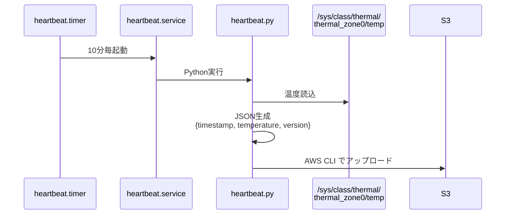

# Heartbeat

Raspberry Piの生存確認とCPU温度を定期的にS3へ送信するコンポーネントです。

## 概要

- **実行方式**: systemd timer (10分毎)
- **送信内容**: タイムスタンプ、CPU温度、バージョン情報
- **S3パス**: `s3://{bucket}/devices/{device_id}/heartbeat/{ISO8601-timestamp}`

## 動作フロー



## 送信データ形式

```json
{
  "timestamp": "2024-01-15T10:00:00+09:00",
  "temperature": 55.3,
  "version": "1.2.0"
}
```

| フィールド | 説明 |
|-----------|------|
| `timestamp` | 時刻（時単位、分秒は00） |
| `temperature` | CPU温度（℃、小数点1桁） |
| `version` | システムバージョン |

## セットアップ

### systemd設定

```bash
# サービス・タイマーインストール
sudo cp heartbeat.service /etc/systemd/system/
sudo cp heartbeat.timer /etc/systemd/system/
sudo systemctl daemon-reload

# 有効化・起動
sudo systemctl enable heartbeat.timer
sudo systemctl start heartbeat.timer
```

### 動作確認

```bash
# タイマー状態確認
sudo systemctl status heartbeat.timer
sudo systemctl list-timers heartbeat.timer

# 手動実行テスト
sudo systemctl start heartbeat.service
sudo journalctl -u heartbeat.service -n 10

# S3確認
aws s3 ls s3://${S3_BUCKET}/devices/${DEVICE_ID}/heartbeat/
```

## トラブルシューティング

### CPU温度が取得できない

```bash
# 温度ファイル確認
cat /sys/class/thermal/thermal_zone0/temp

# 値が返らない場合はハードウェア問題の可能性
# temperatureがnullで送信される（エラーではない）
```

### S3にアップロードされない

```bash
# 環境変数確認
sudo systemctl cat heartbeat.service | grep Environment

# 手動実行
source /etc/pir-monitor/config.env
cd /home/anpi/anpi-watch/pi/heartbeat
python3 heartbeat.py
```

## 関連ドキュメント

- [Pi コンポーネント概要](../README.md)
- [アーキテクチャ](../../docs/ARCHITECTURE.md)
