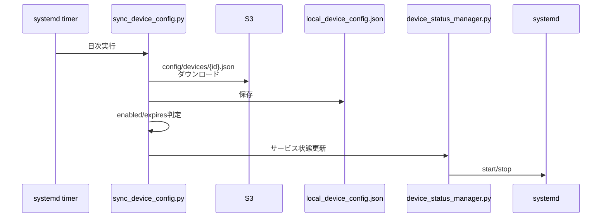

# Sync Device Config

S3からデバイス設定を定期的に同期し、サービスの有効/無効を制御するコンポーネントです。

## 概要

- **実行方式**: systemd timer (日次)
- **機能**: S3設定ダウンロード、ローカル保存、サービス状態反映
- **設定ファイル**: `/home/anpi/anpi-watch/pi/config/local_device_config.json`

## 動作フロー



## 設定同期

### S3設定ファイル

```json
{
  "device_id": "ito-raspi-01",
  "enabled": true,
  "expires": "2026-11-31T23:59:59+09:00",
  "name": "実家あんぴセンサー",
  "no_motion_hours": 8,
  "cpu_temp_threshold": 70,
  "heartbeat_grace_minutes": 90
}
```

### ローカル保存先

- **設定**: `/home/anpi/anpi-watch/pi/config/local_device_config.json`
- **ステータス**: `/home/anpi/anpi-watch/pi/config/runtime_status.json`

## セットアップ

### systemd service/timer設定

```bash
# serviceファイルを配置
sudo cp sync_device_config.service /etc/systemd/system/
sudo cp sync_device_config.timer /etc/systemd/system/

# timer有効化・起動
sudo systemctl daemon-reload
sudo systemctl enable sync_device_config.timer
sudo systemctl start sync_device_config.timer

# ステータス確認
sudo systemctl status sync_device_config.timer
sudo systemctl list-timers sync_device_config.timer
```

### 手動実行

```bash
# serviceを手動実行
sudo systemctl start sync_device_config.service

# 実行結果確認
sudo systemctl status sync_device_config.service
sudo journalctl -u sync_device_config.service -n 20

# 出力例:
# Downloaded config for ito-raspi-01
# Saved local config to /home/anpi/anpi-watch/pi/config/local_device_config.json
# Device is enabled and not expired
```

## サービス制御

設定に基づいて自動的にサービスを制御:

| 条件 | 動作 |
|------|------|
| `enabled: true` かつ有効期限内 | サービス起動 |
| `enabled: false` | サービス停止 |
| 有効期限切れ | サービス停止 |

### 手動サービス管理

```bash
# ステータス確認
python3 /home/anpi/anpi-watch/scripts/device_status_manager.py --status

# サービス更新
python3 /home/anpi/anpi-watch/scripts/device_status_manager.py --update

# 全サービス停止
python3 /home/anpi/anpi-watch/scripts/device_status_manager.py --stop-all
```

## トラブルシューティング

### 設定が同期されない

```bash
# timer状態確認
sudo systemctl status sync_device_config.timer
sudo systemctl list-timers sync_device_config.timer

# serviceログ確認
sudo journalctl -u sync_device_config.service -f

# 手動実行でエラー確認
sudo systemctl start sync_device_config.service
sudo journalctl -u sync_device_config.service -n 50

# S3アクセス確認
source /etc/pir-monitor/config.env
aws s3 ls s3://${S3_BUCKET}/config/devices/
```

### サービスが起動/停止しない

```bash
# runtime_status.json確認
cat /home/anpi/anpi-watch/pi/config/runtime_status.json

# 手動でサービス更新
python3 /home/anpi/anpi-watch/scripts/device_status_manager.py --update

# systemd状態確認
sudo systemctl status pir-watcher.service
sudo systemctl status heartbeat.timer
```

## 関連ドキュメント

- [デバイス設定管理](../../docs/DEVICE_CONFIG.md)
- [Pi コンポーネント概要](../README.md)
- [セットアップガイド](../../docs/SETUP.md)
